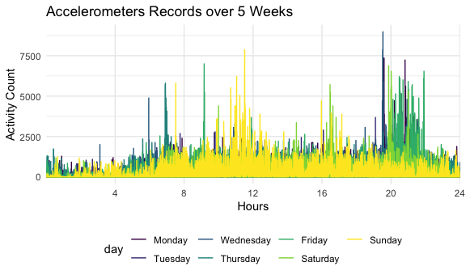
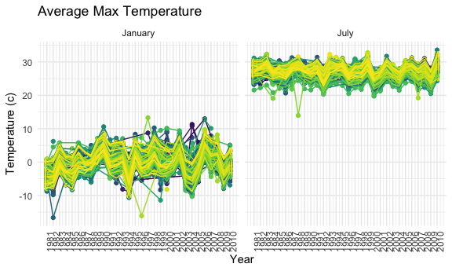
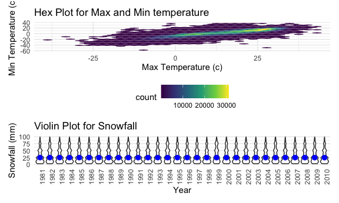

Homework 3
================
Bin Yang

    library(tidyverse)

    ## ── Attaching packages ──────────────────────────────────────────────────────────────────────────── tidyverse 1.3.0 ──

    ## ✓ ggplot2 3.3.2     ✓ purrr   0.3.4
    ## ✓ tibble  3.0.3     ✓ dplyr   1.0.2
    ## ✓ tidyr   1.1.2     ✓ stringr 1.4.0
    ## ✓ readr   1.3.1     ✓ forcats 0.5.0

    ## ── Conflicts ─────────────────────────────────────────────────────────────────────────────── tidyverse_conflicts() ──
    ## x dplyr::filter() masks stats::filter()
    ## x dplyr::lag()    masks stats::lag()

    library(patchwork)

    theme_set(theme_minimal() + theme(legend.position = "bottom"))

    options(
      ggplot2.continuous.colour = "viridis",
      ggplot2.continuous.fill = "viridis"
    )

    scale_colour_discrete = scale_colour_viridis_d
    scale_fill_discrete = scale_fill_viridis_d

Problem 1
---------

    library(p8105.datasets)
    data("instacart")

This dataset contains 1384617 rows and … columns.

Observations are the level of items in orders by user. There are user /
order variables – user ID, order ID, order day, and order hour. There
are also item variables – name, aisle, department, and some numeric
codes.

How many aisles, and which are most items from?

    instacart %>% 
        count(aisle) %>% 
        arrange(desc(n))

    ## # A tibble: 134 x 2
    ##    aisle                              n
    ##    <chr>                          <int>
    ##  1 fresh vegetables              150609
    ##  2 fresh fruits                  150473
    ##  3 packaged vegetables fruits     78493
    ##  4 yogurt                         55240
    ##  5 packaged cheese                41699
    ##  6 water seltzer sparkling water  36617
    ##  7 milk                           32644
    ##  8 chips pretzels                 31269
    ##  9 soy lactosefree                26240
    ## 10 bread                          23635
    ## # … with 124 more rows

Let’s make a plot

    instacart %>% 
        count(aisle) %>% 
        filter(n > 10000) %>% 
        mutate(
            aisle = factor(aisle),
            aisle = fct_reorder(aisle, n)
        ) %>% 
        ggplot(aes(x = aisle, y = n)) + 
        geom_point() + 
        theme(axis.text.x = element_text(angle = 90, vjust = 0.5, hjust = 1))

<!-- -->

Let’s make a table!!

    instacart %>% 
        filter(aisle %in% c("baking ingredients", "dog food care", "packaged vegetables fruits")) %>% 
        group_by(aisle) %>% 
        count(product_name) %>% 
        mutate(rank = min_rank(desc(n))) %>% 
        filter(rank < 4) %>% 
        arrange(aisle, rank) %>% 
        knitr::kable()

| aisle                      | product\_name                                 |    n | rank |
|:---------------------------|:----------------------------------------------|-----:|-----:|
| baking ingredients         | Light Brown Sugar                             |  499 |    1 |
| baking ingredients         | Pure Baking Soda                              |  387 |    2 |
| baking ingredients         | Cane Sugar                                    |  336 |    3 |
| dog food care              | Snack Sticks Chicken & Rice Recipe Dog Treats |   30 |    1 |
| dog food care              | Organix Chicken & Brown Rice Recipe           |   28 |    2 |
| dog food care              | Small Dog Biscuits                            |   26 |    3 |
| packaged vegetables fruits | Organic Baby Spinach                          | 9784 |    1 |
| packaged vegetables fruits | Organic Raspberries                           | 5546 |    2 |
| packaged vegetables fruits | Organic Blueberries                           | 4966 |    3 |

Apples vs ice cream..

    instacart %>% 
        filter(product_name %in% c("Pink Lady Apples", "Coffee Ice Cream")) %>% 
        group_by(product_name, order_dow) %>% 
        summarize(mean_hour = mean(order_hour_of_day)) %>% 
        pivot_wider(
            names_from = order_dow,
            values_from = mean_hour
        )

    ## `summarise()` regrouping output by 'product_name' (override with `.groups` argument)

    ## # A tibble: 2 x 8
    ## # Groups:   product_name [2]
    ##   product_name       `0`   `1`   `2`   `3`   `4`   `5`   `6`
    ##   <chr>            <dbl> <dbl> <dbl> <dbl> <dbl> <dbl> <dbl>
    ## 1 Coffee Ice Cream  13.8  14.3  15.4  15.3  15.2  12.3  13.8
    ## 2 Pink Lady Apples  13.4  11.4  11.7  14.2  11.6  12.8  11.9

Problem 2
---------

Load in the accelerometer data and tidy the data.

    accel_data <- 
      read_csv("./data/accel_data.csv") %>% 
      pivot_longer(                           
        activity.1:activity.1440,
        names_to = "minute",
        values_to = "activity_count",
        names_prefix = "activity.") %>%
      mutate(
        weekend = case_when(
        day == "Saturday" | "day" == "Sunday"  ~ 1,
        TRUE ~ 0)) %>%
      mutate(
        minute = as.numeric(minute),
        week = factor(week),
        weekend = factor(weekend),
        day = factor(day, 
                     levels = c("Monday", "Tuesday", "Wednesday", "Thursday", "Friday", "Saturday", "Sunday"))
        ) %>% 
      select(week:day, weekend, everything())

    ## Parsed with column specification:
    ## cols(
    ##   .default = col_double(),
    ##   day = col_character()
    ## )

    ## See spec(...) for full column specifications.

    skimr::skim_without_charts(accel_data)

|                                                  |             |
|:-------------------------------------------------|:------------|
| Name                                             | accel\_data |
| Number of rows                                   | 50400       |
| Number of columns                                | 6           |
| \_\_\_\_\_\_\_\_\_\_\_\_\_\_\_\_\_\_\_\_\_\_\_   |             |
| Column type frequency:                           |             |
| factor                                           | 3           |
| numeric                                          | 3           |
| \_\_\_\_\_\_\_\_\_\_\_\_\_\_\_\_\_\_\_\_\_\_\_\_ |             |
| Group variables                                  | None        |

Data summary

**Variable type: factor**

| skim\_variable | n\_missing | complete\_rate | ordered | n\_unique | top\_counts                                |
|:---------------|-----------:|---------------:|:--------|----------:|:-------------------------------------------|
| week           |          0 |              1 | FALSE   |         5 | 1: 10080, 2: 10080, 3: 10080, 4: 10080     |
| day            |          0 |              1 | FALSE   |         7 | Mon: 7200, Tue: 7200, Wed: 7200, Thu: 7200 |
| weekend        |          0 |              1 | FALSE   |         2 | 0: 43200, 1: 7200                          |

**Variable type: numeric**

| skim\_variable  | n\_missing | complete\_rate |   mean |     sd |  p0 |    p25 |   p50 |     p75 | p100 |
|:----------------|-----------:|---------------:|-------:|-------:|----:|-------:|------:|--------:|-----:|
| day\_id         |          0 |              1 |  18.00 |  10.10 |   1 |   9.00 |  18.0 |   27.00 |   35 |
| minute          |          0 |              1 | 720.50 | 415.70 |   1 | 360.75 | 720.5 | 1080.25 | 1440 |
| activity\_count |          0 |              1 | 267.04 | 443.16 |   1 |   1.00 |  74.0 |  364.00 | 8982 |

Data description: This dataset contains information regarding fives
weeks of accelerometer data collected on a 63 year-old male. The dataset
contains 50400 observations and 6 variables recording the activity count
for each minute in this five weeks period with no NA value. “week”,
“day\_id”, “day” ,“minute”records the week number, day number, day and
minitue of the experiment. “weekend” is a binary variable that takes
value 0 if that day is a weekday, or 1 if that day is weekend.
“activity\_count” is the activity count for a given mintue in the
experiment.

    accel_data %>% 
      group_by(week, day) %>% 
      summarise(
        total_activity = sum(activity_count)
      ) %>% 
      pivot_wider(
        names_from = "day",
        values_from = "total_activity"
      ) %>% 
      knitr::kable(digits = 1)

    ## `summarise()` regrouping output by 'week' (override with `.groups` argument)

| week |   Monday |  Tuesday | Wednesday | Thursday |   Friday | Saturday | Sunday |
|:-----|---------:|---------:|----------:|---------:|---------:|---------:|-------:|
| 1    |  78828.1 | 307094.2 |    340115 | 355923.6 | 480542.6 |   376254 | 631105 |
| 2    | 295431.0 | 423245.0 |    440962 | 474048.0 | 568839.0 |   607175 | 422018 |
| 3    | 685910.0 | 381507.0 |    468869 | 371230.0 | 467420.0 |   382928 | 467052 |
| 4    | 409450.0 | 319568.0 |    434460 | 340291.0 | 154049.0 |     1440 | 260617 |
| 5    | 389080.0 | 367824.0 |    445366 | 549658.0 | 620860.0 |     1440 | 138421 |

After examining the table, we are not able to identify any clear trends.
Generally this person has higher activity counts in the first few days
of the week. We noticed that the activity counts are extremely low on
Saturday in week 4 and 5, compared to other values.

    accel_data %>% 
      ggplot(aes(x = minute, y = activity_count), alpha = 0.3) + 
      geom_line(aes(color = day)) +
      labs(title = "Accelerometers Records over 5 Weeks",
           x = "Hours", 
           y = "Activity Count") +
      scale_x_discrete(
        limit = c(240, 480, 720, 960, 1200, 1440),
        labels = c("4", "8", "12", "16", "20", "24")
        )

    ## Warning: Continuous limits supplied to discrete scale.
    ## Did you mean `limits = factor(...)` or `scale_*_continuous()`?

<!-- -->

We observed that activity counts generally rise from midnight to 12 pm,
decrease in the afternoon, spike after 8pm and finally decrease after
roughly 10 pm. Generally speaking, this person has higher activity level
in the weekdays compared to weekends.

Problem 3
---------

    library(p8105.datasets)
    data("ny_noaa")

    skimr::skim(ny_noaa)

|                                                  |          |
|:-------------------------------------------------|:---------|
| Name                                             | ny\_noaa |
| Number of rows                                   | 2595176  |
| Number of columns                                | 7        |
| \_\_\_\_\_\_\_\_\_\_\_\_\_\_\_\_\_\_\_\_\_\_\_   |          |
| Column type frequency:                           |          |
| character                                        | 3        |
| Date                                             | 1        |
| numeric                                          | 3        |
| \_\_\_\_\_\_\_\_\_\_\_\_\_\_\_\_\_\_\_\_\_\_\_\_ |          |
| Group variables                                  | None     |

Data summary

**Variable type: character**

| skim\_variable | n\_missing | complete\_rate | min | max | empty | n\_unique | whitespace |
|:---------------|-----------:|---------------:|----:|----:|------:|----------:|-----------:|
| id             |          0 |           1.00 |  11 |  11 |     0 |       747 |          0 |
| tmax           |    1134358 |           0.56 |   1 |   4 |     0 |       532 |          0 |
| tmin           |    1134420 |           0.56 |   1 |   4 |     0 |       548 |          0 |

**Variable type: Date**

| skim\_variable | n\_missing | complete\_rate | min        | max        | median     | n\_unique |
|:---------------|-----------:|---------------:|:-----------|:-----------|:-----------|----------:|
| date           |          0 |              1 | 1981-01-01 | 2010-12-31 | 1997-01-21 |     10957 |

**Variable type: numeric**

| skim\_variable | n\_missing | complete\_rate |  mean |     sd |  p0 | p25 | p50 | p75 |  p100 | hist  |
|:---------------|-----------:|---------------:|------:|-------:|----:|----:|----:|----:|------:|:------|
| prcp           |     145838 |           0.94 | 29.82 |  78.18 |   0 |   0 |   0 |  23 | 22860 | ▇▁▁▁▁ |
| snow           |     381221 |           0.85 |  4.99 |  27.22 | -13 |   0 |   0 |   0 | 10160 | ▇▁▁▁▁ |
| snwd           |     591786 |           0.77 | 37.31 | 113.54 |   0 |   0 |   0 |   0 |  9195 | ▇▁▁▁▁ |

This dataset contains weather information for all New York state weather
stations from January 1, 1981 through December 31, 2010. It has 2595176
observations and 7 variables. Specifically, the variables contains
following information:  
id: Weather station ID  
date: Date of observation  
prcp: Precipitation (tenths of mm)  
snow: Snowfall (mm)  
snwd: Snow depth (mm)  
tmax: Maximum temperature (tenths of degrees C)  
tmin: Minimum temperature (tenths of degrees C).  
There are many miss values in the dataset. Specifically, There are
around 40% missing values in “tmax” and “tmin”, 20% missing values in
“snwd”, 15% missing values in “snow” and 6% missing values in “prcp”.
Given such large amount of missing values, we should probably drop these
missing values prior to analysis.

    ny_noaa_tidy = 
      ny_noaa %>% 
      separate(date, into = c("year", "month", "day"), sep = "-") %>% 
      mutate(
        tmax = as.numeric(tmax),
        tmin = as.numeric(tmin)
      ) %>% 
      mutate(
        prcp = prcp/10,
        tmax = tmax/10,
        tmin = tmin/10
      )

    ny_noaa_tidy %>% 
      count(snow, name = "snow_count") %>% 
      arrange(desc(snow_count)) %>% 
      head(10) %>% 
      knitr::kable()

| snow | snow\_count |
|-----:|------------:|
|    0 |     2008508 |
|   NA |      381221 |
|   25 |       31022 |
|   13 |       23095 |
|   51 |       18274 |
|   76 |       10173 |
|    8 |        9962 |
|    5 |        9748 |
|   38 |        9197 |
|    3 |        8790 |

The most commonly observed value for snowfall is 0 as most of days we
don’t observe any snowfall.

    ny_noaa_tidy %>%  
      drop_na() %>% 
      filter(month %in% c("01","07")) %>% 
      group_by(id, year, month) %>% 
      summarise(
        avg_tmax = mean(tmax)
      ) %>%
      ggplot(aes(x = as.numeric(year), y = avg_tmax, color = id)) +
      geom_point() + geom_line() +
      labs(
        title = "Average Max Temperature",
        x = "Year",
        y = "Temperature (c)"
      ) +
      scale_x_continuous(breaks = 1981:2010) +
      theme(legend.position = "none",
            axis.text.x = element_text(angle = 90, hjust = 0)) +
      facet_grid(. ~ month, labeller = labeller(month = c("01" = "January", "07" = "July"))) 

    ## `summarise()` regrouping output by 'id', 'year' (override with `.groups` argument)

<!-- -->

From this plot, we observed several extreme values, such as in 1982,
1996 January and 1988 July. Otherwise, we don’t see any clear trends in
the plot.

    plot1 =
      ny_noaa_tidy %>%  
      drop_na() %>% 
      ggplot(aes(x = tmax, y = tmin)) + 
      labs(
        title = "Hex Plot for Max and Min temperature",
        x = "Max Temperature (c)", 
        y = "Min Temperature (c)"
      ) + 
      geom_hex()

    plot2 = 
      ny_noaa_tidy %>%  
      drop_na() %>% 
      filter(snow > 0 & snow < 100) %>% 
      ggplot(aes(x = year, y = snow)) + 
      geom_violin() + 
      stat_summary(fun = "median", color = "blue") + 
      labs(
        title = "Violin Plot for Snowfall",
        x = "Year",
        y = "Snowfall (mm)"
      ) +
      theme(axis.text.x = element_text(angle = 90, hjust = 0))

    plot1 / plot2

    ## Warning: Removed 30 rows containing missing values (geom_segment).

<!-- -->
